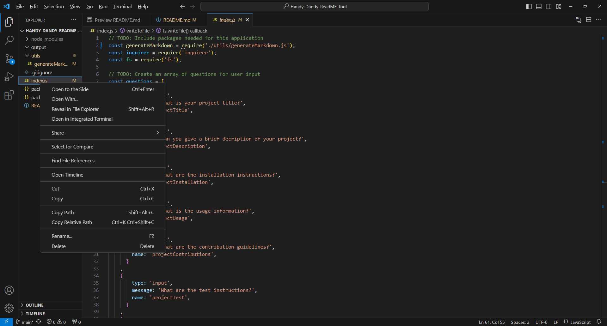
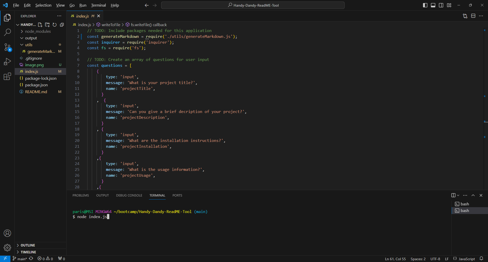
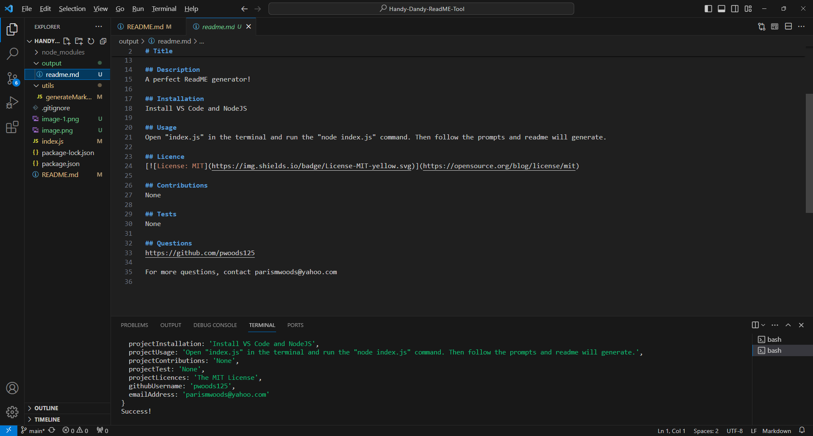
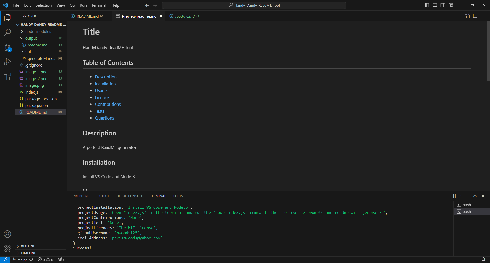
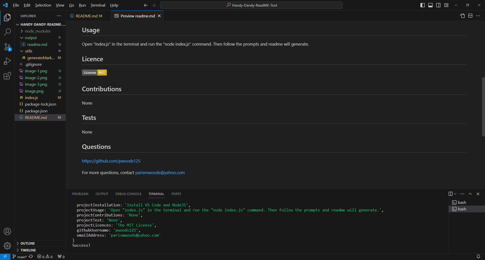

# Handy-Dandy-ReadME-Tool

## Description
An expert README tool for developers.

### Usage
- Right click on the index.js file and select "Open in Integrated Terminal."
- Run the "node index.js" command. 
- After following the prompts, the ReadME will generate under the output folder. 

#### Link To Walkthrough
https://drive.google.com/file/d/1THNuJ1yPjvHpZqvbD7I4vT2iB5oLjUfH/view?usp=sharing

#### Additional Screenshots

